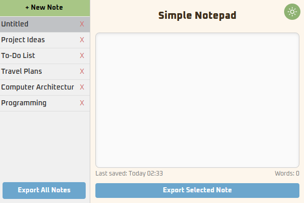
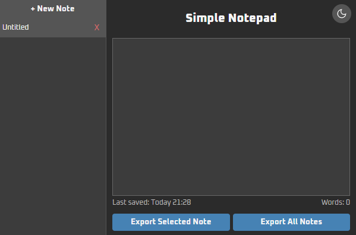

# 📝 Simple Notepad Chrome Extension

A minimal Chrome extension to quickly write, save, and manage notes directly in your browser.  
Now includes **context menu note saving**, **silent auto-dismiss notifications**, **auto-save**, **light/dark mode toggle**, and **export notes as .txt**.

---

## 🚀 Features

- Save selected text via **right-click context menu**
- Silent notifications with auto-dismiss after 3.5 seconds
- Auto-save notes (stored locally with `chrome.storage.local`)
- Light/Dark mode with theme toggle button
- Export notes as `.txt` file

---

## 📂 Installation

1. Clone or download this repository.
2. Open **Chrome** → go to `chrome://extensions/`.
3. Enable **Developer mode** (top-right corner).
4. Click **Load unpacked** and select this project folder.
5. The extension will appear in your toolbar.

---

## 📸 Screenshots

### Light Mode

### Dark Mode

## 
