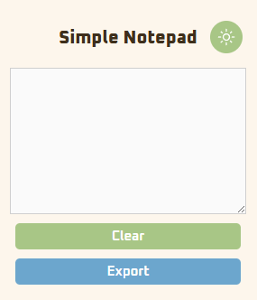
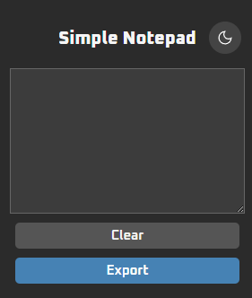

# 📝 Simple Notepad Chrome Extension

A minimal Chrome extension to quickly write, save, and manage notes directly in your browser.  
Includes **auto-save**, **delete with confirmation**, **light/dark mode toggle**, and **export notes as .txt**.

---

## 🚀 Features
- Auto-save notes (stored locally with `chrome.storage.local`)  
- Delete notes with confirmation modal  
- Light/Dark mode with theme toggle button  
- Export notes as `.txt` file  
- Clean and minimal UI with Google Fonts  

---

## 📂 Installation
1. Clone or download this repository.  
2. Open **Chrome** → go to `chrome://extensions/`.  
3. Enable **Developer mode** (top-right corner).  
4. Click **Load unpacked** and select this project folder.  
5. The extension will appear in your toolbar.  

---

## 📸 Screenshots

### Light Mode

### Dark Mode

---
